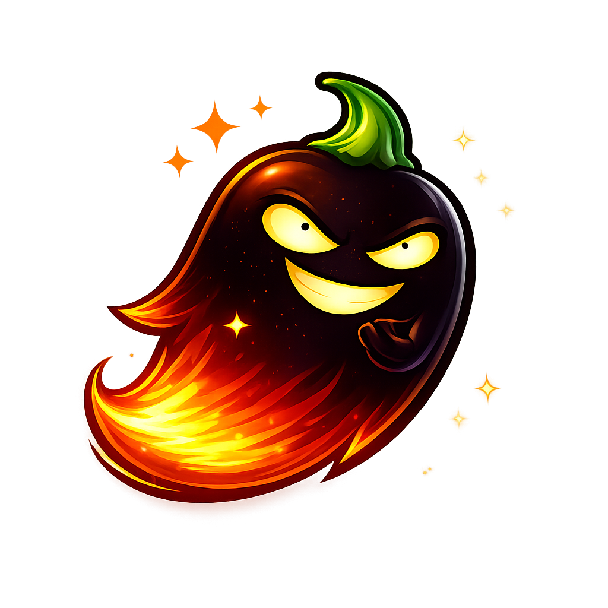

  

<h1 align="center">Ghost Pepper 🌶️</h1>

  A macOS menu bar app for system-wide hold-to-talk speech-to-text. 
  Hold the Control key to record, release to transcribe and paste into any text field. 
  Runs 100% locally — no cloud APIs, no data leaves your machine.

## Download

**[Download GhostPepper.dmg](https://github.com/matthartman/ghost-pepper/releases/latest/download/GhostPepper.dmg)** — Open the DMG and drag Ghost Pepper to your Applications folder.

> Requires macOS 14.0+ and Apple Silicon (M1 or later).

## Features

- **Hold-to-talk** — Hold Control to record, release to transcribe and paste
- **100% local** — All processing happens on your Mac using Apple Silicon
- **Menu bar app** — Lives in your menu bar, no dock icon
- **Smart cleanup** — Optional LLM-powered text cleanup removes filler words ("um", "uh") and handles self-corrections
- **Audio device picker** — Choose your input microphone from the dropdown
- **Clipboard safe** — Saves and restores your clipboard around each paste

## Models

Ghost Pepper uses two open-source models, both running locally on your Mac:

### Speech-to-Text: WhisperKit
- **Model:** [openai_whisper-small.en](https://huggingface.co/argmaxinc/whisperkit-coreml) (~466 MB)
- **Framework:** [WhisperKit](https://github.com/argmaxinc/WhisperKit) by Argmax — on-device speech recognition optimized for Apple Silicon via CoreML
- **License:** MIT

### Text Cleanup: Qwen 2.5 1.5B (via MLX)
- **Model:** [Qwen2.5-1.5B-Instruct-4bit](https://huggingface.co/mlx-community/Qwen2.5-1.5B-Instruct-4bit) (~1 GB) from the [MLX Community](https://huggingface.co/mlx-community) on Hugging Face
- **Framework:** [MLX Swift](https://github.com/ml-explore/mlx-swift) by Apple — machine learning framework for Apple Silicon
- **License:** Apache 2.0

Both models are downloaded automatically from [Hugging Face](https://huggingface.co/) on first use.

## Requirements

- macOS 14.0 (Sonoma) or later
- Apple Silicon (M1 or later)
- ~2 GB RAM for both models
- ~1.5 GB disk space for model files

## Getting Started

1. Clone the repo
2. Open `GhostPepper.xcodeproj` in Xcode
3. Build and run (Cmd+R)
4. Grant **Microphone** and **Accessibility** permissions when prompted
5. Look for the waveform icon in your menu bar
6. Hold Control and speak — your words appear wherever your cursor is

## Permissions

| Permission | Why |
|-----------|-----|
| **Microphone** | Record your voice |
| **Accessibility** | Global hotkey detection and text pasting via simulated keystrokes |

## Tech Stack

- **Swift / SwiftUI** — Native macOS app
- **WhisperKit** — Speech-to-text (CoreML, Apple Silicon optimized)
- **MLX Swift** — Text cleanup LLM inference (Apple Silicon optimized)
- **AVAudioEngine** — Audio capture
- **CGEvent** — Global hotkey monitoring and keystroke simulation

## Acknowledgments

- [WhisperKit](https://github.com/argmaxinc/WhisperKit) by Argmax for on-device speech recognition
- [MLX](https://github.com/ml-explore/mlx) by Apple for the machine learning framework
- [Hugging Face](https://huggingface.co/) for model hosting and the MLX community model conversions
- [OpenAI Whisper](https://github.com/openai/whisper) for the original speech recognition model
- [Qwen](https://github.com/QwenLM/Qwen2.5) by Alibaba for the language model

## License

MIT
